# Image Search Engine
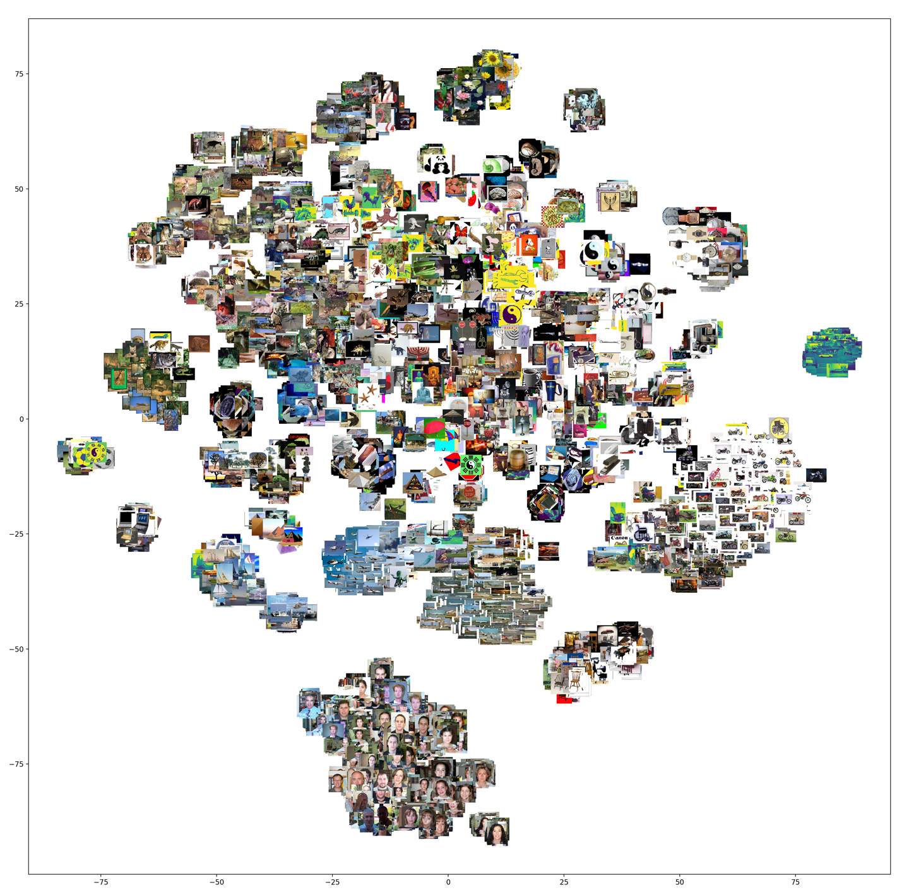
*Visualization showing image clusters; similar images are in the same cluster*

# Table of Contents
1. [Project objective and experimental protocol](#1)
2. [Analysis of the experimental results](#2)
    1. [Histogram method](#2-1)
        1. [Influence of the norm](#2-1-a)
        2. [Varying the size of the bins](#2-1-b)
        3. [Search execution time](#2-1-c)
        4. [Conclusion](#2-1-d)
    2. [Visual Bag of Words Method with a linear index](#2-2)
        1. [Variation of norms and normalization](#2-2-a)
        2. [Variation in vocabulary size](#2-2-b)
        3. [Comparison of weightings between two vocabularies](#2-2-c)
        4. [Execution time as a function of vocabulary size](#2-2-d)
    3. [Visual Bag of Words Method with an Inverted Index](#2-3)
        1. [Variation of the vocabulary size](#2-3-a)
        2.  [Computation time as a function of vocabulary size ](#2-3-b)
        3. [Conclusion](#2-3-c)
    4. [VLAD Method](#2-4)
        1. [Variation of PCA dimensions](#2-4-a)
        2. [Variation of vocabulary size](#2-4-b)
        3. [Analysis of the execution time ](#2-4-c)
        4. [Conclusion](#2-4-d)
3. [General Conclusion](#3)

## 1- Project objective and experimental protocol 
- In this project, the objective is to explore 3 distinct methods for creating an image search engine. The 3 models in question are : 
    - **Research based on colour histograms**: A histogram is a statistical curve showing the distribution of pixels according to their value. We convert the images into colour histograms from the 3 histograms of each of the Red, Green and Blue components which we join into one. The objective of this method is to compare the histogram values of the query and the histograms in the search database to find out if the images describe the same scene. One of the potential shortcomings of this methodology is related to the exposure of the image. Indeed, the values of the histogram fluctuate according to the lighting and therefore the intensity. It is therefore possible to take exactly the same photo with different light levels and have two different histograms.

    - **Searching with  bags of visual words (SIFT)**: The use of visual bags of words is based on SIFT (Scale Invariant Feature Transform) descriptors. These are numerical information derived from the local analysis of an image and characterise the visual content of this image as independently as possible of the scale ("zoom" and resolution of the sensor), the framing, the viewing angle and the exposure (brightness). From a predefined vocabulary of fixed size we can find the closest visual word for each descriptor. Thus, for each image, we have a list of words and their frequency in the image. To perform a search, we will need to compare the frequency of words between the query and each image in the database.
    To use this methodology, we used several possible indexations on the database. A linear indexing, which is the classical use of an index, which from the ID of an image we obtain its bag of visual words. An inverted index, which from the words of the vocabulary, returns the IDs that contain visual words.
    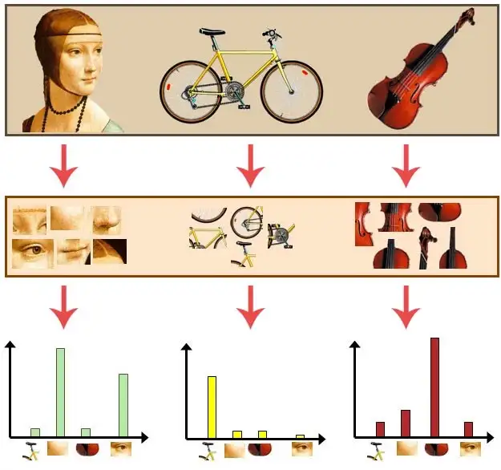
    *How a bag of visual words works*

    - **VLAD descriptor search**: VLAD descriptors (Vector of Locally Aggregated Descriptors) follow the principle of word bags but give more information about the descriptors. Each picture is represented by the sum of the residuals between the visual word and its descriptor for each word in the vocabulary. This gives a matrix of vocabulary size x descriptor size. It is possible to perform a PCA on each matrix in order to optimise memory space and to obtain better results.
    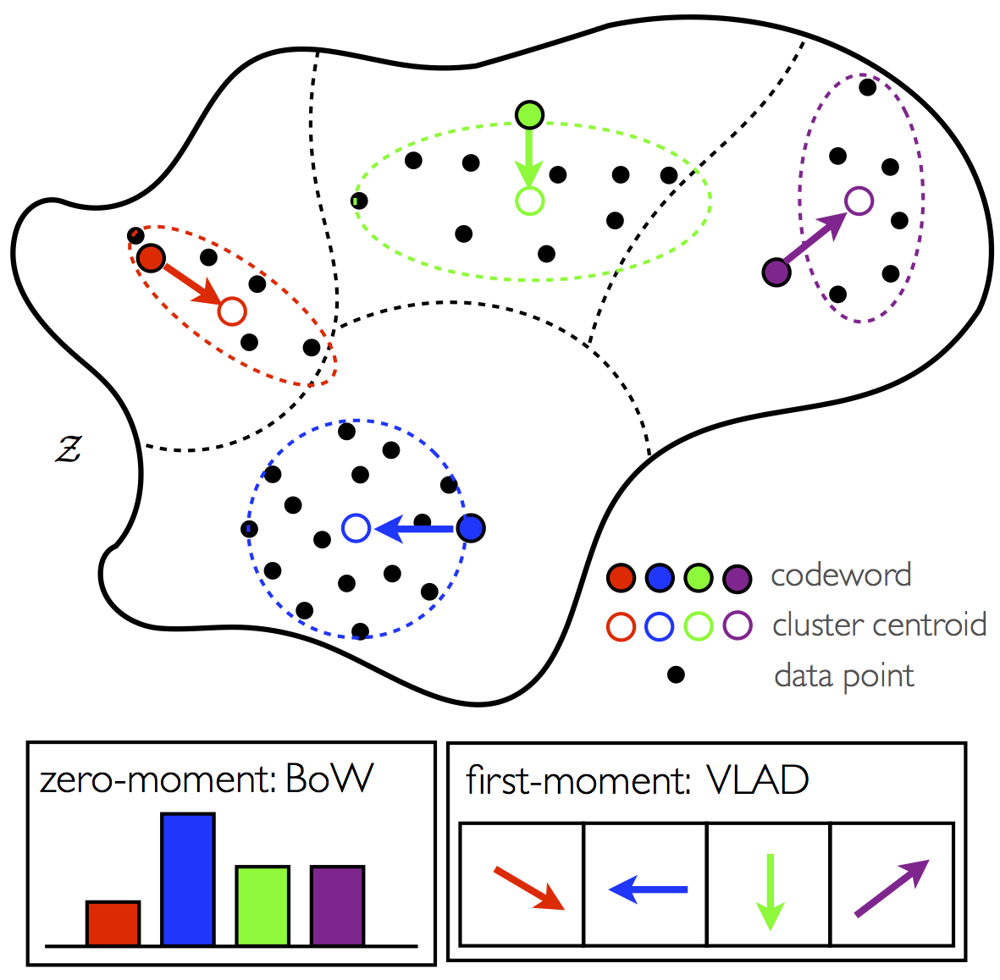
    *Visualisation of a VLAD descriptor works*

- The objective of this project is therefore to study the influence of the different parameters of our three systems  on the quality of the results. Here is what these 3 parameters correspond to: 
    - **Norm:** In a similarity search context, the choice of distance is a very important parameter. The most used in a Machine Learning context are the Euclidean, Manahattan, Cosine and Chebyshev distances. The image below will help us understand the intuition behind each of these methods. In a context of similarity research applied to images, only the Manhattant(L1) and Euclidean distances are relevant, we will only be interested in these two in this project.
    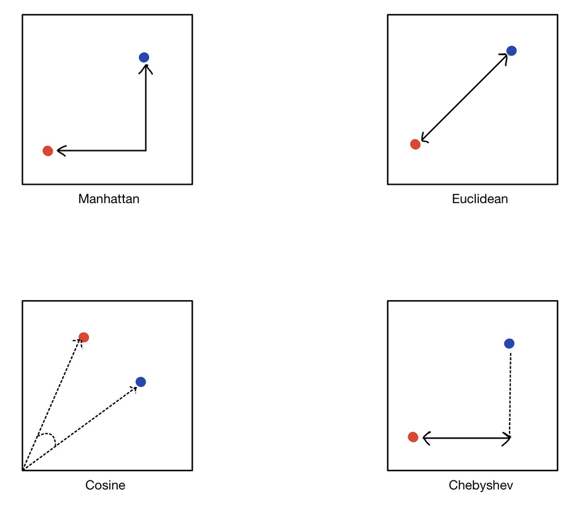
    - **Number of bins:** A histogram plots the frequency of a numeric variable by splitting it into bins. The x-axis of a histogram has the bins and the y-axis has the frequency of samples in those bins. Shape of a histogram may vary by the number of bins. Hence, it is important to choose the right number of bins to correctly view the distribution of a numeric variable. Below is an example to show the varying shape of a histogram with the number of bins.
    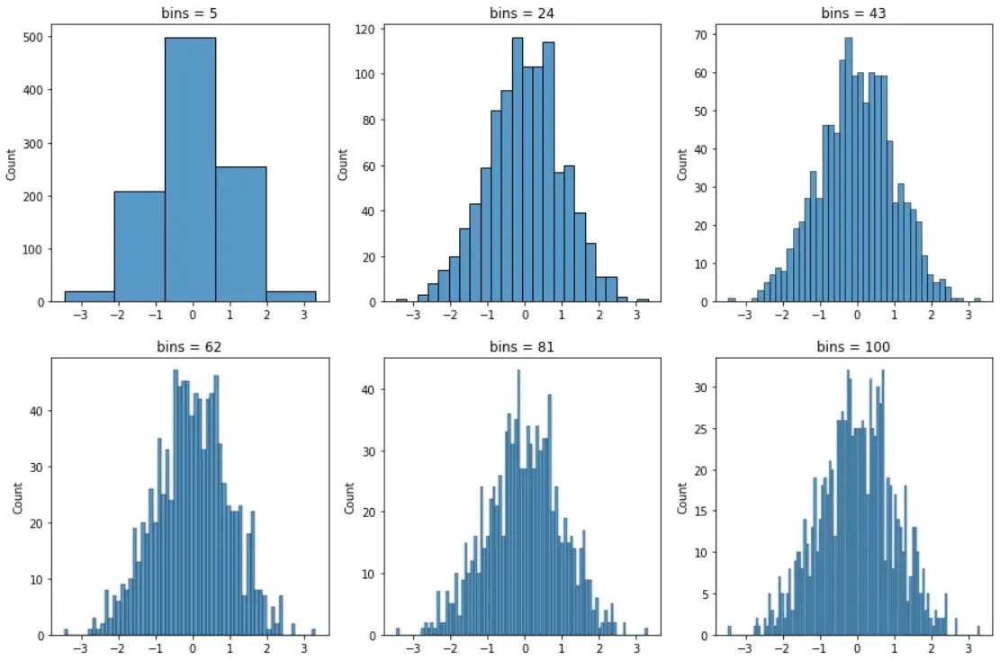
    - **Vocabulary size:** a bag of visual words is a vector of occurrence counts of a vocabulary of local image features.The size of the vocabulary is therefore the number of visual words listed in it
    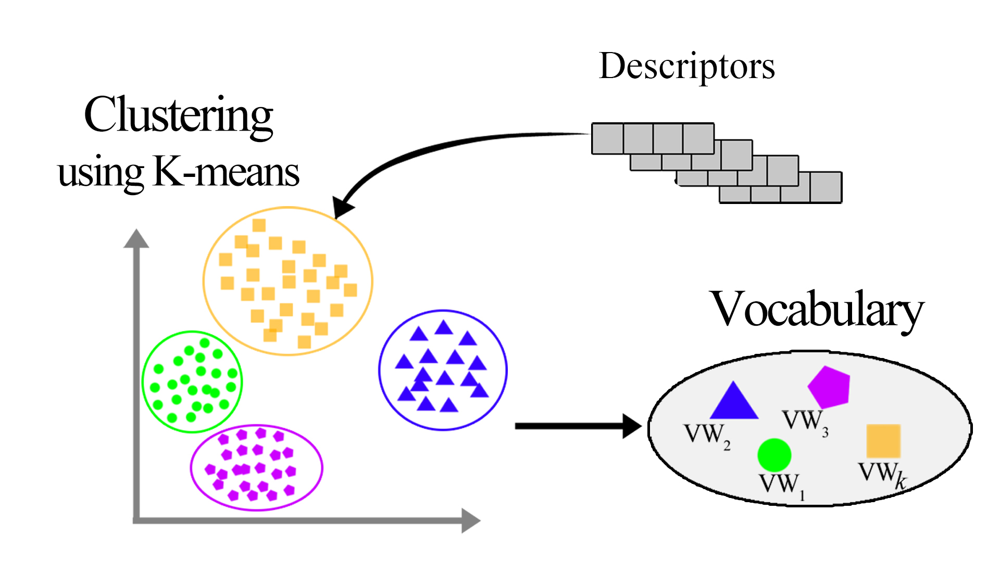

- The analysis is based on three main metrics: **mAP score**, **recall/accuracy curves**, and **average query computation time**.

Thus, here is the experimental protocol for the 3 methods
- The evaluation for the histogram consists of the variation of the standard, the number of bins and the calculation time for a query.
- For the bag-of-words system, the influence of the index pre-processing (normalisation/weighting) is first examined, followed by the influence of the chosen norm on the results. In a second step, the influence of the vocabulary size on the accuracy of the system, as well as on the computation time of a query is analysed. Finally, we will add an inverted index to our system and study its influence on the results.
- The evaluation on the VLAD descriptor will be based on the influence of the number of principal components obtained by PCA, and will end with the influence of the vocabulary size.

## 2- Analysis of the experimental results 

### 1- Histogram method 

#### a) Influence of the norm 
We varied the norm for calculating the distances between the L1 norm  and the L2 norm. For this test, we set the size of each bin at 12. We observe that the mAP score and the Recall-Accuracy curves of the L1 norm perform better. For this reason, we will keep L1 as the norm in the following.

    - Score mAP with L1= 0.81
    - Score mAP with L2= 0.74

- *Comparison of l1 l2 norms with recall/accuracy curves:*

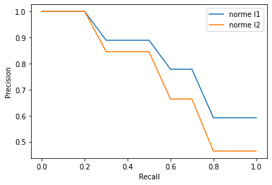

#### b) Varying the size of the bins
By varying the size of the bins, we observe that the more numerous the bin, the better the mAP score up to a certain threshold. To find this optimal threshold we varied the size of [16, 512, 1728 , 4096 , 8000 ] bins. We found 4096 "bins" as the optimal value for the emAP score and for the Recall-Precision criterion. Going beyond 4096 bins would be useless because the precision will not be better.
- *Display of the evolution of the mAP score depending on the number of bins:*

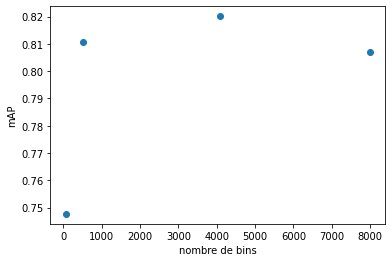
- *Display of recall/accuracy curves as a function of the number of bins:*

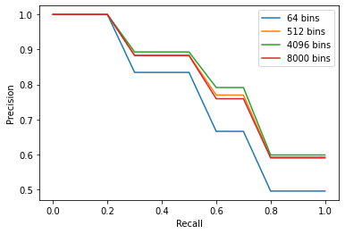

#### c) Search execution time 
 We can observe an increase in the average execution time of a query as a function of the number of bins. This is due to the increase in the dimensions of the histograms, making the calculation of distances much more time consuming. This evolution follows a linear form.

- *Display of the evolution of the query calculation time as a function of the number of bins:*

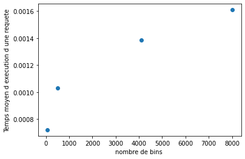

#### d) Conclusion 

To conclude, we observe that the L1 distance seems to be optimal for histogram-based systems. For our database, 4096 bins size seems to provide the best scores. Increasing the number of bins will not be of any use because in addition to obtaining a decrease in accuracy, the execution time will be more consequent given the increase in the number of dimensions.

### 2- Visual Bag of Words Method with a linear index 

#### a) Variation of norms and normalization

We set the vocabulary size to 1000. We wanted to analyse the impact of the change of the norm to calculate the distances between the bags of words of the images and the utility of normalisation. We can observe first the benefit of normalising our data by comparing the mAP score and the Recall-Accuracy curves. There is a clear difference between the normalized and non-normalized scores. It is necessary to normalise the data because each image does not have the same number of descriptors. In a second step, we can see that when calculating the distances,L1 norm performs better.

    - Score mAP L1 normalized = 0.86 
    - Score mAP L2 normalized = 0.79
    - Score mAP L1 non-normalized = 0.50
    - Score mAP L2 non-normalized = 0.67
- *Display of precision recall curves according to the chosen norm, for normalised and non-normalised word bags (Vocabulary size: 1000 words):*

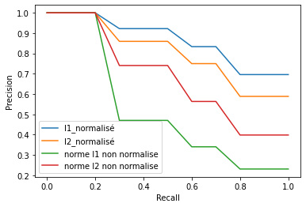

#### b) Variation in vocabulary size 
We wanted to see the interest of the size of the vocabulary. We first understood that the larger the vocabulary, the better the results as shown in the first two graphs.
- *Precision recall curves as a function of vocabulary size:*

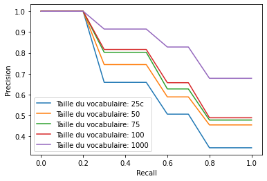
- *Evolution of the mAP score as a function of vocabulary size:*

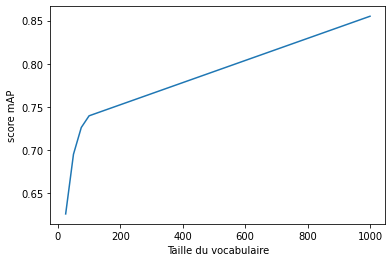

#### c) Comparison of weightings between two vocabularies  
- We compared the scores of the weighting methods between two extreme sizes of the vocabulary (50 and 5000). It can be seen that the weighting idf.racine(tf) does not work for a small vocabulary size but it gives a better result when the vocabulary grows.
- *Recall curves for precision weighting with vocabulary 50:*

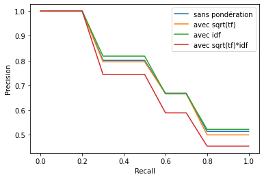
- *Weighting precision recall curves with vocabulary 5000:*

#### d) Execution time as a function of vocabulary size 
We have calculated the execution time of a search for a linear index. We see that the time is linearly dependent on the vocabulary.

- *Average computation time as a function of vocabulary size:*

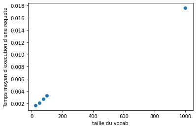

### 3- Visual Bag of Words Method with an Inverted Index 
 **Note**: For the analysis of the inverted index we will only study the parameters concerning the size of the vocabulary and the execution time because the principle of the bag of words remains the same. The only difference comes from the indexing of the images.
#### a) Variation of the vocabulary size 

We can see that the scores obtained are very similar to the linear index. We can therefore say that the vocabulary size has the same impact on the search scores.
- *Precision recall curves as a function of vocabulary size:*

- *Evolution of the mAP score as a function of vocabulary size:*

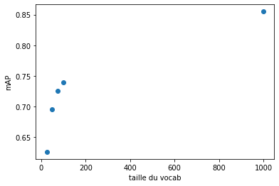

### b) Computation time as a function of vocabulary size 
Looking at the graph, we understand that the compute time of a search is higher than the linear index method. This is problematic because the search in the inverted index should theoretically be faster than in a linear index. The reason for such a high time is that we use vocabulary sizes that are too small. This has an impact on the size of the short-list to be inspected to find the closest image, because with a small vocabulary size, the short-list consists of all the documents in the corpus. This means that the short-list is a considerable waste of time. Increasing the size of the vocabulary could result in much smaller shortlists and therefore a lower execution time than the linear index search.

- *Average calculation time as a function of vocabulary size:*

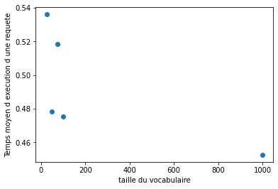

#### c) Conclusion 
We can notice that the L1 norm is the best for calculating distances. This method is very interesting and efficient as long as the vocabulary to describe an image is important. This imposes a pre-processing for the creation of the long index. The search for a query is not faster than for a histogram. To overcome this time problem, the use of an inverted index allows the bag-of-words method to compete with other methods.

### 4- VLAD Method 

#### a) Variation of PCA dimensions 
 PCA allows to reduce the number of components and to highlight only the relevant information. From these graphs we can observe that PCA helps to improve the accuracy and the mAP score up to a certain threshold, where it becomes inefficient. The VLAD system with a PCA of 50 components is the most optimal for the mAP score. Going beyond 50 components results in a loss of performance.

 - *Display of recall/accuracy curves as a function of the number of PCA dimensions*

 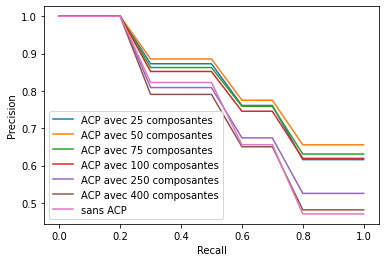

 - *Display of the evolution of the score map according to the number of dimensions of the PCA*

  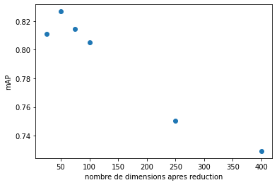

#### b) Variation of vocabulary size 
  We used the VLAD algorithm without PCA in order to directly visualise the impact of vocabulary size on the metrics. It can be seen that the VLAD descriptor works more accurately with a small vocabulary size. On the two graphs we can see that the optimal size is 50.
  - *Display of recall/accuracy curves as a function of vocabulary size*

  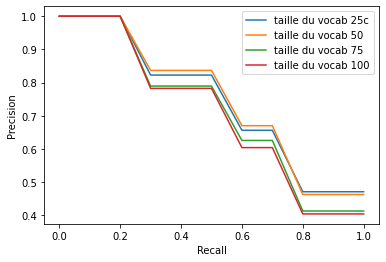

  - *Display of the evolution of the score map according to the size of the vocabulary*

  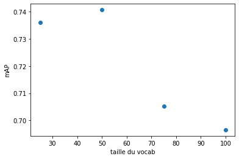
#### c) Analysis of the execution time 
  We could notice that the time evolves linearly according to our two criteria. When we increase the number of components, in addition to causing a loss of precision, the execution time increases.
  - *Average computation time as a function of the size of the vocabulary*

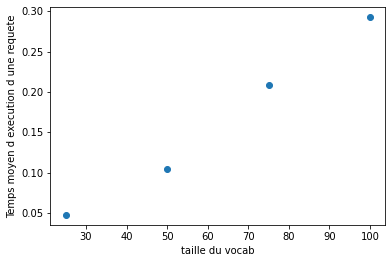
- *Average calculation time as a function of the number of principal components*

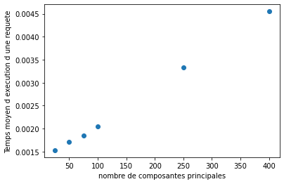

#### d) Conclusion 
To conclude, we can notice that the VLAD system allows to obtain a very good compromise between accuracy and execution time. Principal Component Analysis not only increases the accuracy (provided that the number of components is well chosen) but also decreases the execution time as the number of dimensions decreases. Another advantage of the VLAD system is that it provides good accuracy for small vocabularies, since it provides maximum accuracy for a vocabulary size of 50 words.

### General Conclusion

By varying the parameters of each system, we were able to analyse their strengths and weaknesses. Personally, this lab/project has allowed me to better understand the functioning of these systems. We were able to develop our analytical skills in terms of optimising these systems.