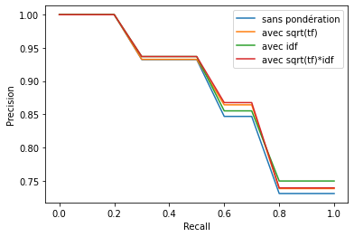

# Image Search Engine
## 1- Objectif du projet et protocole expérimental
- Dans ce projet, l'objectif est d'explorer 3 méthodes distinctes pour créer un moteur de recherche sur des images. Un moteur de recherche sur image, c'est: les 3 modèles en question sont : 

    - **Research based on colour histograms**: A histogram is a statistical curve showing the distribution of pixels according to their value. We convert the images into colour histograms from the 3 histograms of each of the Red, Green and Blue components which we join into one. The objective of this method is to compare the histogram values of the query and the histograms in the search database to find out if the images describe the same scene. One of the potential shortcomings of this methodology is related to the exposure of the image. Indeed, the values of the histogram fluctuate according to the lighting and therefore the intensity. It is therefore possible to take exactly the same photo with different light levels and have two different histograms.

    - **Searching with visual bags of words (SIFT)**: The use of visual bags of words is based on SIFT (Scale Invariant Feature Transform) descriptors. These are numerical information derived from the local analysis of an image and characterise the visual content of this image as independently as possible of the scale ("zoom" and resolution of the sensor), the framing, the viewing angle and the exposure (brightness). From a predefined vocabulary of fixed size we can find the closest visual word for each descriptor. Thus, for each image, we have a list of words and their frequency in the image. To perform a search, we will need to compare the frequency of words between the query and each image in the database.
    To use this methodology, we used several possible indexations on the database. A linear indexing, which is the classical use of an index, which from the ID of an image we obtain its bag of visual words. An inverted index, which from the words of the vocabulary, returns the IDs that contain visual words.

    - **VLAD descriptor search**: VLAD descriptors (Vector of Locally Aggregated Descriptors) follow the principle of word bags but give more information about the descriptors. Each picture is represented by the sum of the residuals between the visual word and its descriptor for each word in the vocabulary. This gives a matrix of vocabulary size x descriptor size. It is possible to perform a PCA on each matrix in order to optimise memory space and to obtain better results.

- L'objectif, lors de ce projet est donc d’étudier l’influence des différents paramètres de nos 3 systèmes (norme utilisée, nombre de bins, taille du vocabulaire...) sur la qualité des résultats. Voci à quoi correspondent ces 3 paramètres : 
    - Norme
    - Nombre de bins 
    - Taille du vocbulaire

-  L'analyse est basée  selon trois principales métriques: le score mAP, les courbes rappel/précision, et le temps moyen de calcul d’une requête.
    - score mAP:
    - courbes rappel/precision
    - temps moyen de calcul d’une requête:

Ainsi, voici le protocole expérimental pour les 3
- L'évaluation pour l’histogramme est constituée de la variation de la norme, du nombre de bins et du temps de calcul pour une requête.
- Pour le système par sac de mots commencedans un premier temps l’influence du prétraitement de l’index (normalisation/pondération) puis l’influence de la norme choisie sur les résultats. Dans un second temps, l'analyse de l’influence de la taille du vocabulaire sur la précision du système, ainsi que sur le temps de calcul d’une requête. Enfin, l'ajout à notre système un index inversé et étudierons l’influence de celui-ci sur les résultats.
- L’évaluation sur le descripteur VLAD sera basée sur l’influence du nombre de composantes principales obtenus par ACP, puis finira par l’influence de la taille du vocabulaire.

## 2- Analyse des résultats d’expérimentation

### 1- Méthode par Histogramme

#### a) Influence de la norme : 
-  Nous avons fait varier la norme de calcul des distances entre l anormeL1(Minkowski)et la normeL2(Euclidienne).Pource test,nousavons fixé la taille de chaque “bin” à 12. On observe sur le score mAP et les courbes Rappel- Précision de la norme L1 sont plus performantes. Pour cette raison par la suite nous garderons L1 comme norme.
    - Score mAP de L1= 0.81
    - Score mAP de L2= 0.7413455768690386

- *Confrontation des normes l1 l2 avec les courbes rappel/précision* :

#### b) Variation de la taille de bins
- En faisant varier la taille des “bins”, on observe que plus le “bin” est grand, meilleur est le score mAP jusqu’à un certain seuil. Pour trouver ce seuil optimal nous avons fait varier la taille [16, 512, 1728 , 4096 , 8000 ] “bins”. Nous avons trouvé 4096 “bins”comme valeur optimale pour le scor emAP et pour le critère Rappel-Précision. Aller au-delà de 4096 bins serait donc inutile car la précision n’en sera pas meilleure.
- *Affichage de l'évolution du score mAP en fonction du nombre de bins :*

- *Affichage des courbes rappel/précision en fonction du nombre de bins :*

#### c) Temps d'exécution d’une recherche
- Nous pouvons observer une augmentation du temps moyen d’exécution d’une requête en fonction du nombre de “bins”. Cela est dû à l’augmentation des dimensions des histogrammes, rendant les calculs de distances beaucoup plus chronophage. Cette évolution suit une forme linéaire.
- *Affichage de l'évolution du temps de calcul du requête en fonction du nombre de bin :*

#### d) Conclusion :

- Pour conclure, nous observons que la distance de Minkowski semble optimale pour les systèmes par histogrammes. Pour notre base de données, 4096 de taille de “bins” semble fournir les meilleurs scores. Augmenter le nombre de “bins” ne sera d’aucune utilité car en plus d’obtenir une baisse de précision, le temps d'exécution sera plus conséquent étant donné l’augmentation du nombre de dimensions.

### 2- Méthode par Sacs de mots visuels avec un index linéaire

#### a)Variation des normes et de la normalisation : 
- Nous avons fixé la taille du vocabulaire à 1000. Nous avons voulu analyser l’impact du changement de la norme pour calculer les distances entre les sacs de mots des images et l’intérêt de normaliser. Nous pouvons observer dans un premier temps l’intérêt de normaliser nos données en comparant le score mAP et les courbes Rappel-précision. Il y a une nette différence entre les scores normalisés et les non-normalisés. Il est nécessaire de normaliser les données car chaque image ne dispose pas du même nombre de descripteurs comme nous pouvons le voir sur l’image suivante qui représente la taille des 11 premières images. La première valeur du tableau correspond au nombre de descripteurs. Donc les valeurs au sein du vocabulaire ne sont pas comparables correctement sans normaliser au préalable. Dans un second temps, nous pouvons voir que lors du calcul des distances pour la recherche des requêtes les plus pertinentes L1 est plus performant.

    - Score mAP L1 normalisé = 0.86 
    - Score mAP L2 normalisé = 0.79
    - Score mAP L1 non-normalisé = 0.50
    - Score mAP L2 non-normalisé = 0.67
- *Affichage des courbes rappel précision en fonction de la norme choisie, pour les sacs de mots normalisés et non normalisés (Taille du vocabulaire: 1000 mots):*

#### b) Variation de la taille du vocabulaire : 
- Nous avons voulu voir l’intérêt de la taille du vocabulaire. Nous avons d’abord compris que plus le vocabulaire est grand, meilleurs sont les résultats comme le montre les deux premiers graphiques.
- *Courbes rappel précision en fonction de la taille du vocabulaire*:

- *Evolution du score mAP en fonction de la taille du vocabulaire :*

#### c) Comparaison des pondérations entre deux vocabulaires :
- Nous avons comparé les scores des méthodes de pondérations entre deux tailles extrêmes du vocabulaire (50 et 5000). On peut voir que la pondération idf.racine(tf) ne fonctionne pas pour un vocabulaire de petite taille mais il permet d’avoir un meilleur résultat lorsque le vocabulaire croit.
- *Courbes rappel précision des pondérations avec vocabulaire 50:*

- *Courbes rappel précision des pondérations avec vocabulaire 5000:*

#### d) Temps de calcul en fonction de la taille du vocabulaire : 
- Nous avons calculé le temps d'exécution d’une recherche pour un index linéaire. Nous voyons que le temps est dépendant du vocabulaire linéairement.

- *Temps de calcul moyen en fonction de la taille du vocabulaire:*

### 3- Méthode par Sacs de mots visuels avec un index inversé
- **Note**: Pour l’analyse de l’index inversé nous n’étudierons que les paramètres concernant la taille du vocabulaire et le temps d'exécution car le principe du sac de mots reste le même. La seule différence vient de l’indexation des images.
#### a) Variation de la taille du vocabulaire : 

- Nous pouvons voir que les scores obtenus sont très similaires à l’index linéaire. Nous pouvons donc dire que la taille du vocabulaire a le même impact sur les scores des recherches.
- *Courbes rappel précision en fonction de la taille du vocabulaire:*

- *Evolution du score mAP en fonction de la taille du vocabulaire:*

### b) Temps de calcul en fonction de la taille du vocabulaire : 
- En observant le graphique, on comprend que le temps d’une recherche est supérieur à l’index linéaire. Cela pose problème car la recherche dans l’index inversé doit être théoriquement plus rapide que celle dans un index linéaire. La raison à un temps si élevé est que nous utilisons des tailles de vocabulaire trop faibles. Cela provoque une incidence sur la taille de la short-list à inspecter pour trouver l’image la plus proche.En effet, avec un vocabulaire de petite taille, la short-list se compose de tous les documents du corpus. L’établissement de la short-list représente alors une perte considérable de temps d'exécution. Augmenter la taille du vocabulaire pourrait résulter à des short-list beaucoup plus petites et donc a un temps d'exécution inférieur à la recherche par index linéaire.

- *Temps de calcul moyen en fonction de la taille du vocabulaire:*

#### c) Conclusion ;
- Nous pouvons remarquer que la norme L1 est la meilleure pour calculer les distances. Cette méthode est très intéressante et performante à partir du moment ou le vocabulaire pour décrire une image est important. Cela impose un pré-traitement pour la création de l’index long. La recherche pour une requête n’est pas plus rapide que pour celle d’histogramme. Pour combler ce problème de temps, l’utilisation d’un index inversé permet à la méthode de sacs de mots de concurrencer les autres méthodes.

### 4- Méthode 